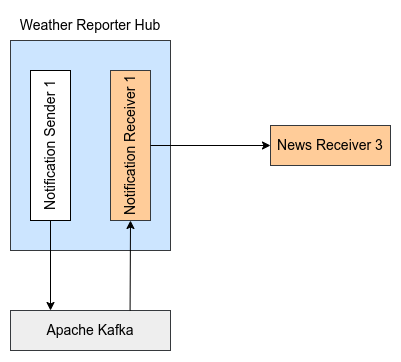
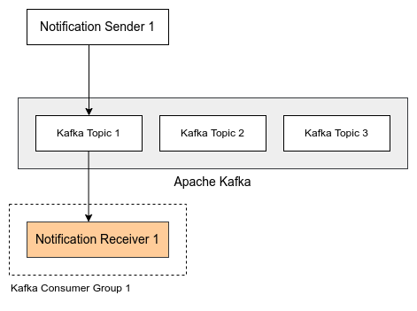

# Weather Reporter #

The project contains a Websub-compliant `hub` implementation which acts as a weather alerts distribution hub. News channels that need to receive 
weather alerts for a particular location can subscribe to the `hub` and receive periodic weather alerts. The `hub` uses [Open Weather Map](https://openweathermap.org/) API to retrieve weather reports for a given location.

Following is the high-level component diagram for this implementation.


## Implementation ##

As depicted in the component diagram, the implementation is backed by the Apache Kafka message broker. Therefore, the Apache Kafka message broker will be doing 
most of the heavy lifting. 

The following flow diagram depicts the notification dispatching flow with the Apache Kafka integration.



According to the flow diagram, there are two components, namely `Notification Sender` and `Notification Receiver` available within the `hub`. The `Notification Sender` component periodically publishes weather reports into a Kafka topic. The `Notification Receiver` component listens to the Kafka topic and upon receiving an event, it forwards the message to the `News Receiver` (News channel). Each `Notification Receiver` component is directly associated with a corresponding `News Receiver` and each `Notification Sender` is directly associated with a particular location for which the weather reports are generated.

The diagram below illustrates how the components within the `hub` are mapped to Kafka topics and consumer groups.



As every `Notification Sender` is linked to a location, a corresponding Kafka topic will be assigned to each location. Additionally, since each `Notification Receiver` is connected to a `News Receiver`, a unique Kafka consumer group will be allocated to every `Notification Receiver`.

## Usage ##

This section discusses how to set up and run the deployment of the weather reporter `hub`.

### Setting up Apache Kafka ###

Refer to [Apache Kafka Quickstart](https://kafka.apache.org/quickstart) guide for the instruction on setting up a Kafka server on your local machine.

### Starting the Hub ###

1. Get the `API_KEY` from [Open Weather Map](https://openweathermap.org/) and set up `OPEN_WEATHER_APP_KEY` environment variable.
```sh
export OPEN_WEATHER_APP_KEY="xxxx"
```

2. Go into `weather-reporter-hub` directory.
```sh
cd weather-reporter-hub
```

3. Execute the following command to build the `hub` project.
```sh
bal build
```

4. Execute the following command to run the `hub`.
```sh
bal run target/bin/weather_reporter.jar
```

### Subscribing to the weather notifications ###

1. Go into `examples/subscriber` directory.
```sh
cd examples/subscriber
```

2. Execute the following command to build the sample news receiver.
```sh
bal build news_receiver.bal
```

3. Execute the following command to run the sample news receiver.
```sh
bal run news_receiver.jar
```
