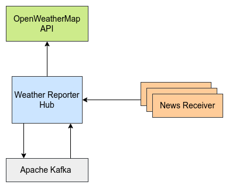

# Weather Reporter #

The project contains a Websub-compliant `hub` implementation which acts as a weather alerts distribution hub. News channels that need to receive 
weather alerts for a particular location can subscribe to the `hub` and receive periodic weather alerts.

Following is the high-level component diagram for this implementation.



## Usage ##

This section discusses how to set up and run the deployment of the weather reporter `hub`.

### Starting the Hub ###

1. Go into `weather-reporter-hub` directory.
```sh
cd weather-reporter-hub
```

2. Execute the following command to build the `hub` project.
```sh
bal build
```

3. Execute the following command to run the `hub`.
```sh
bal run target/bin/weather_reporter.jar
```

### Subscribing to the weather notifications ###

1. Go into `examples/subscriber` directory.
```sh
cd examples/subscriber
```

2. Execute the following command to build the sample news receiver.
```sh
bal build news_receiver.bal
```

3. Execute the following command to run the sample news receiver.
```sh
bal run news_receiver.jar
```
